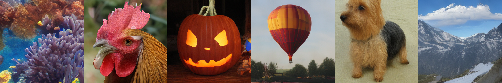

<div align="center">
  <h1>Stabilizing Consistency Training: A Flow Map Analysis and Self-Distillation</h1>
  <a href="https://arxiv.org/abs/2601.22679">
    
  </a>
  <a href="#citation">
    
  </a>
  <br />
  <br />
  <a href="https://revsic.github.io/">Youngjoong Kim</a>,
  Duhoe Kim,
  Woosung Kim,
  <a href="https://jaesik.info/">Jaesik Park</a><sup>&dagger;</sup>
  <br />
  <strong>Seoul National University</strong>
  <br />
  <sup>&dagger;</sup> Corresponding author.
  <br />
  <br />
  <p align="center">
    
  </p>
</div>

## Requirements

This repository has been tested in the following conda environments:
- Python 3.12.11, CUDA 11.8, NVIDIA RTX 3090
- Python 3.12.12, CUDA 12, NVIDIA A100
- Python 3.12.12, CUDA 12.9, NVIDIA H200

See [requirements.txt](./requirements.txt) for Python dependencies. The default versions have been tested in the RTX 3090 environment, and the commented versions have been tested in the H200 environment.
```bash
pip install -r requirements.txt
```

## Preparation

1. Download the required materials from [Hugging Face](https://huggingface.co/YoungJoong/improvedSelfDistillation):
   - [Pretrained weights](https://huggingface.co/YoungJoong/improvedSelfDistillation/tree/main/outputs)
   - [VAE checkpoints](https://huggingface.co/YoungJoong/improvedSelfDistillation/tree/main/buffers/vaes) and latent statistics
   - [Reference files](https://huggingface.co/YoungJoong/improvedSelfDistillation/tree/main/buffers/refs) for FID calculation

| Checkpoint | Network | Steps | FID50K |
| --- | --- | --- | --- |
| [2026.02.15KST14.22.08-base4](https://huggingface.co/YoungJoong/improvedSelfDistillation/tree/main/outputs/2026.02.15KST14.22.08-base4) | FlowMapTiT-B/4 (SD-VAE, TrigFlow) | 400K | 14.58 |
| [2026.01.18KST19.26.11-xlarge1](https://huggingface.co/YoungJoong/improvedSelfDistillation/tree/main/outputs/2026.01.18KST19.26.11-xlarge1) | ADiT-XL/1 (VA-VAE, Linear) | 600K | 2.30 |

2. Place the downloaded `outputs` and `buffers` directories at the top level of the repository.
3. Preprocess the dataset (skip this step if you are not training networks):
```bash
CUDA_VISIBLE_DEVICES=0,1,2,3,4,5,6,7 accelerate launch \
    --num_processes 8 \
    --num_machines 1 \
    --mixed_precision bf16 \
    data.py \
    --data_path /data/imagenet-1k/ILSVRC2012_img_train \
    --config sdvae_f8c4 \
    --image_size 256 \
    --batch_size 20 \
    --num_workers 8
```

## Usage

Train few-step models with improved self-distillation:
```bash
# Use the training script.
bash train.sh

# Or run the training command directly.
CUDA_VISIBLE_DEVICES=1 accelerate launch \
    --dynamo_backend=no \
    --num_processes=1 \
    --num_machines=1 \
    --mixed_precision=bf16 \
    train.py \
    --config ./configs/base4.yaml
```

Evaluate models by calculating FID and Inception Score:
```bash
bash eval.sh
```

## License

This repository is released under the non-commercial research and educational use license in [LICENSE](LICENSE). It is a source-available research release and is not distributed under an OSI-approved open-source license.

The improved Self-Distillation research license applies only to the original code in this repository that is owned by the authors. Third-party software, models, weights, and datasets remain under their own license terms. See [THIRD_PARTY.md](THIRD_PARTY.md) for a concise inventory.

## Acknowledgements

This repository is mainly based on [LINs-Lab/UCGM](https://github.com/LINs-lab/UCGM), [LTH14/JiT](https://github.com/LTH14/JiT), and [hustvl/LightningDiT](https://github.com/hustvl/LightningDiT). We thank the authors for their excellent projects.

## Citation

```bibtex
@misc{kim2026stabilizingconsistencytrainingflow,
      title={Stabilizing Consistency Training: A Flow Map Analysis and Self-Distillation},
      author={Youngjoong Kim and Duhoe Kim and Woosung Kim and Jaesik Park},
      year={2026},
      eprint={2601.22679},
      archivePrefix={arXiv},
      primaryClass={cs.LG},
      url={https://arxiv.org/abs/2601.22679},
}
```
